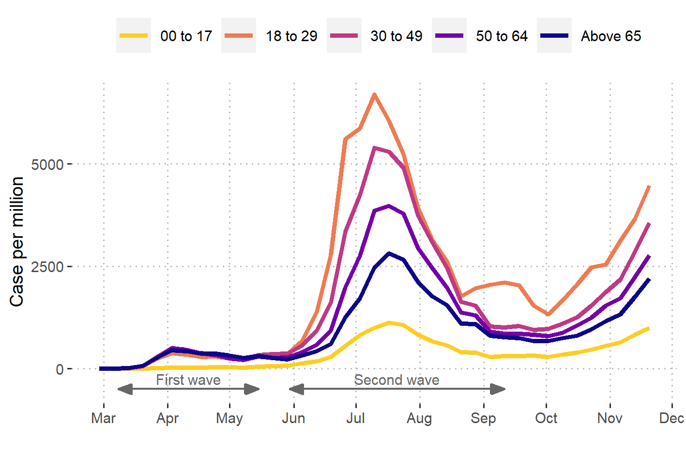
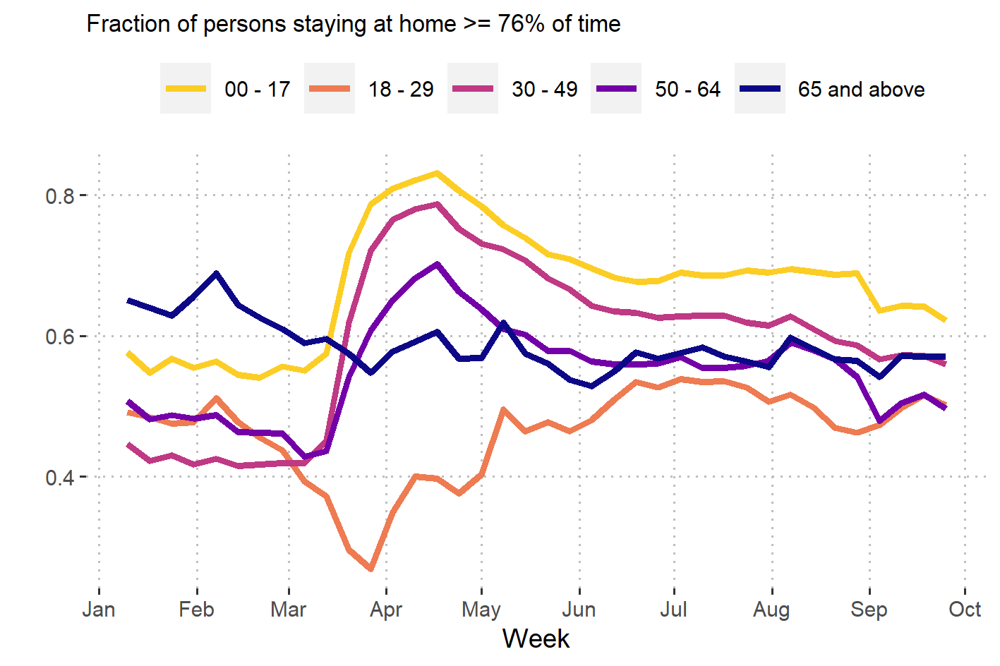
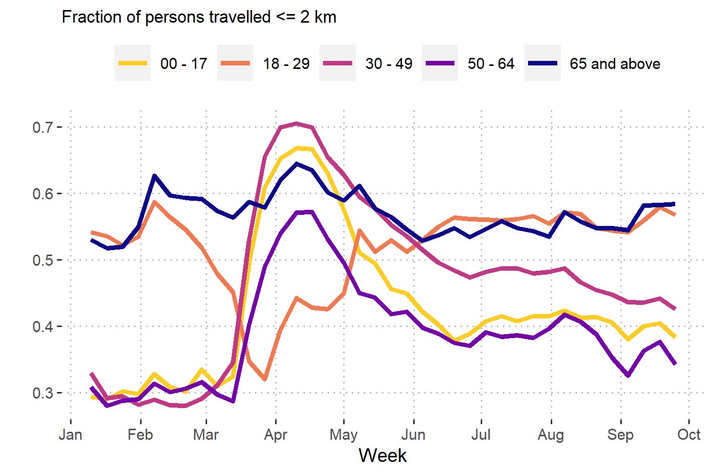
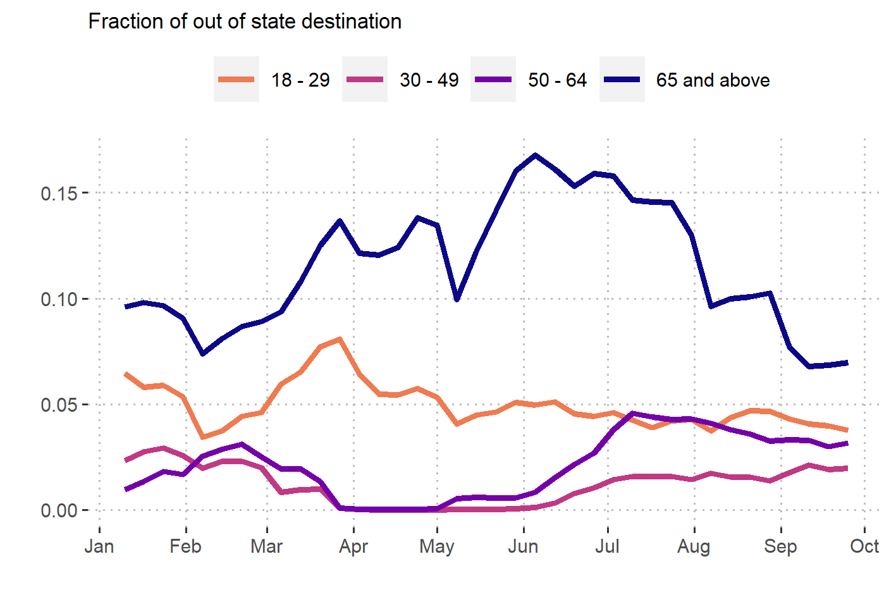

# Age Breakdown of Mobility

```{r echo=FALSE, fig.align='center'}

```

---
# Age Breakdown of Mobility

```{r echo=FALSE, fig.align='center'}

```

---
# Age Breakdown of Mobility

```{r echo=FALSE, fig.align='center'}

```

---
# Age Breakdown of Mobility

```{r echo=FALSE, fig.align='center'}

```

---
# Synthetic Population
.pull-left[
- 20.6m people 

- 8.9m households

- 7.6k schools

- 3.9k long-term-care facilities

- 307 hospitals

- 2.3m other workplaces
]

.pull-right[
```{r echo=FALSE, fig.align='center'}
knitr::include_graphics("../assets/img/hhwp.png")
```
]

---
# Synthetic Population

```{r echo=FALSE, fig.align='center'}
knitr::include_graphics("../assets/img/abm_synthpop.png")
```

---
# Prevalence vs Incidence

- Available Data: Prevalence under 5 years old

- Decision criteria: Incidence (of all ages)

- Conversion from prevalence under five to incidence of all ages
  - Prevalence → Incidence not always linear, especially for older children and adults
  - Major limitation: meta-analysis does not always reflect the ground, but it is the best estimate we have