class: inverse, center, middle

# Self Introduction

---

```{r echo=FALSE, out.width="100%", fig.align='center'}
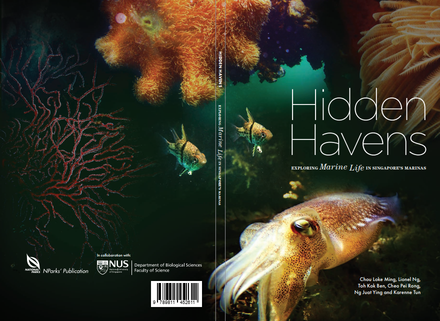
```

---

```{r echo=FALSE, out.width="100%", fig.align='center'}
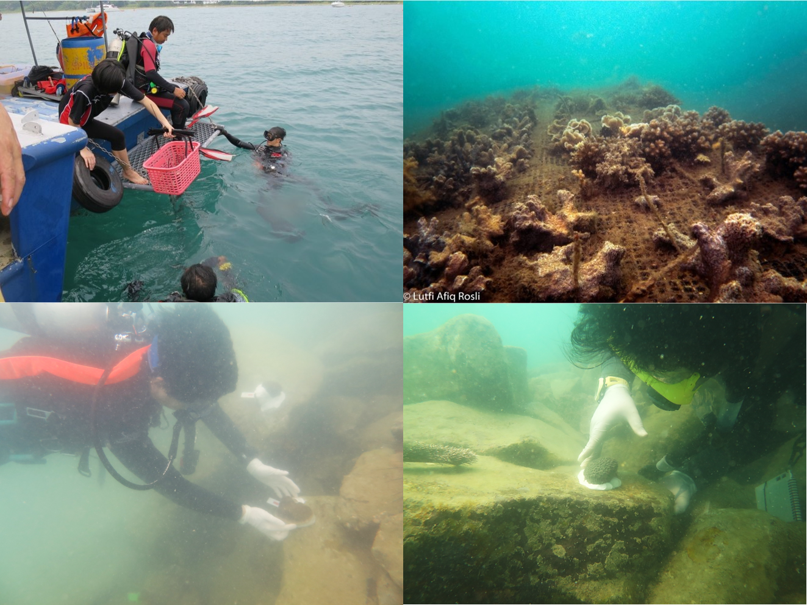
```

---
# Overview

### Part I Improving National Level Spatial Mapping of Malaria through Alternative Spatial and Spatio-temporal Models

```{r echo=FALSE, out.width="90%", fig.align='center'}
knitr::include_graphics("../assets/img/malaria-risk-bf-intro.png")
```

---
### Part II Interactive visualizer and simulator for decision support

.pull-left[
```{r echo=FALSE, fig.align='center'}
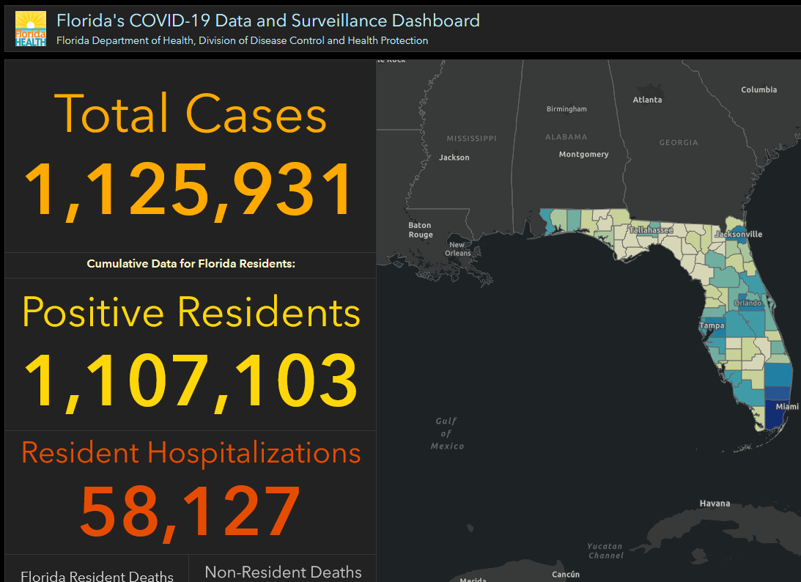
```
]

.pull-right[
```{r echo=FALSE, fig.align='center'}
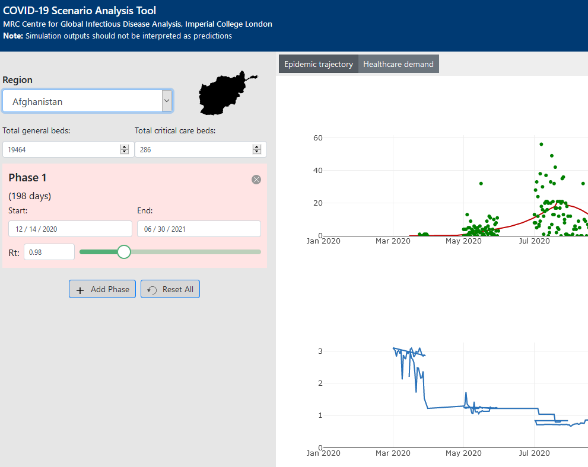
```
]

---
### Part III Agent-based Model of COVID-19 Transmission in Florida

```{r echo=FALSE, out.width="78%", fig.align='center'}
knitr::include_graphics("../assets/img/flcovid-RCHD.png")
```

---

class: inverse, center, middle

# Part I Improving National Level Spatial Mapping of Malaria through Alternative Spatial and Spatio-temporal Models

---
# Background summary

.pull-right1[
- Mapping of malaria prevalence based on national malaria survey data

- Choices choices choices of models
  - Common approach: SPDE-INLA
  - Alternative: Generalized Additive Model (GAM)
  - Alternative: Gradient Boosted Models/Trees (GBM)

- More choices: To include the past dataset or not (Spatial vs Spatiotemporal settings)
]

.pull-left1[
```{r echo=FALSE, out.width="50%", fig.align='center'}
knitr::include_graphics("../assets/img/spde-gamgbm-length.png")
```
]

---
# Objectives

- To determine if GAM and state-of-the-art machine learning method (e.g. GBM), under both spatial and spatio-temporal setting, can be good alternatives to the more complicated SPDE method

- To determine if inclusion of past data is beneficial in modeling the current spatial distribution of malaria prevalence at the national scale

---
# Data

- Demographic Health Survey data from five countries

- Spatial covariates: free and publicly available remote sensing or GIS products

.pull-left[
```{r echo=FALSE, fig.align='center'}
knitr::include_graphics("../assets/img/map-chp1-5cty.png")
```
]

.pull-right[
```{r echo=FALSE, fig.align='center'}
knitr::include_graphics("../assets/img/chp1-covars-layer.png")
```
]

---

# Model comparison

- 5 countries × 4 models × 2 settings
- Spatial setting

```{r echo=FALSE, fig.align='center'}
knitr::include_graphics("../assets/img/chp1-schema-sp.png")
```

- Spatiotemporal setting

```{r echo=FALSE, fig.align='center'}
knitr::include_graphics("../assets/img/chp1-schema-st.png")
```


---
# Results

- GAM and SPDE 👍

```{r echo=FALSE, out.width="60%", fig.align='center'}
knitr::include_graphics("../assets/img/BF_LLMAE.png")
```

---
# Results

- GAM and SPDE 🙌

```{r echo=FALSE, out.width="60%", fig.align='center'}
knitr::include_graphics("../assets/img/UG_LLMAE.png")
```

---
# Results

- Very small difference among top models (look at the axis)

```{r echo=FALSE, out.width="60%", fig.align='center'}
knitr::include_graphics("../assets/img/NG_LLMAE.png")
```

---
# Results

- GBM 😲

```{r echo=FALSE, out.width="60%", fig.align='center'}
knitr::include_graphics("../assets/img/ML_LLMAE.png")
```

---
# Results

- GBM 😲 GAM 😨

```{r echo=FALSE, out.width="60%", fig.align='center'}
knitr::include_graphics("../assets/img/MW_LLMAE.png")
```

---
# Spatial vs Spatiotemporal setting

```{r echo=FALSE, out.width="60%", fig.align='center'}
knitr::include_graphics("../assets/img/Diff-MAE-pres.png")
```

---
# Discussions

.pull-left[
- No single best model, performance varies from setting to setting and country to country

- SPDE is consistent, but doesn't gain much from incorporating past data
  - Can deteriorate when past and present spatial dependency are very different
]

.pull-right[
```{r echo=FALSE, fig.align='center'}
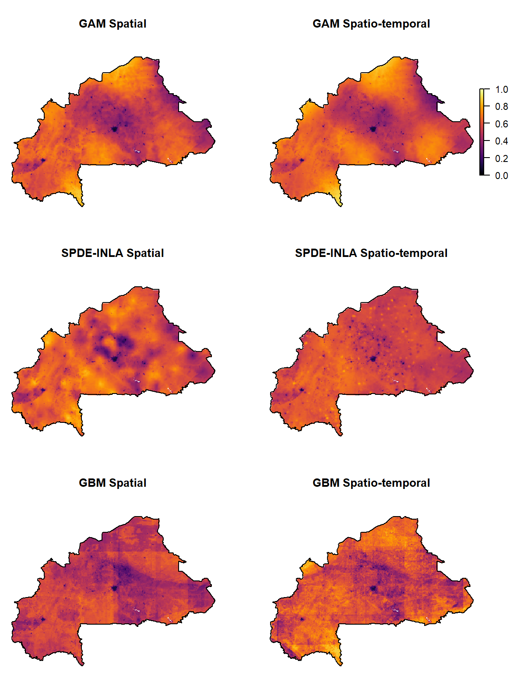
```
]

---
# Discussions

.pull-left[
GAM is good, fast and simple-to-use alternative, especially with more data

But ...
]

.pull-right[
```{r echo=FALSE, fig.align='center'}
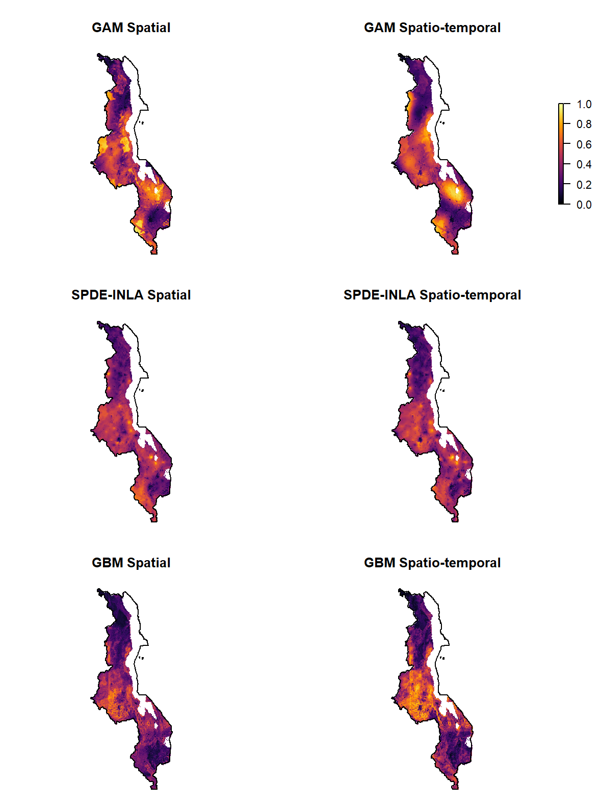
```
]

---
# Discussions

```{r echo=FALSE, fig.align='center'}
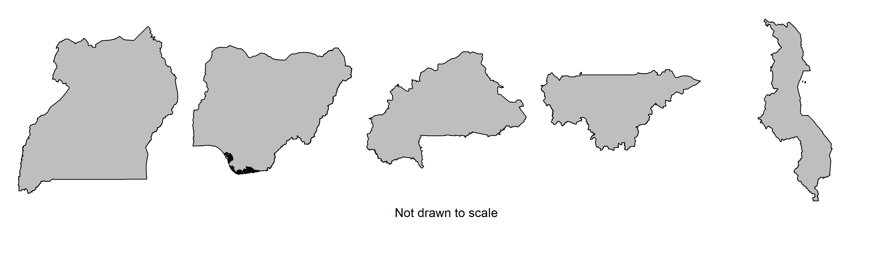
```

- GAM: Dismal performance in irregularly shaped countries

- High perimeter to root area ratio: Malawi 8.7, Uganda 5.7

---
# Discussions

- GBM unpredictable but generally fits well with more data available

- 🏠💬 Fit multiple model or at least benchmark with GAM

---
class: inverse, center, middle

# Part II Interactive visualizer and simulator for decision support

---
# Interactive tools

- Bridging the gap between modelers and stakeholders

- Enhance understanding of the models by "using" them

- Informed decisions

- Increasingly easy to create: No longer requires in-depth knowledge in Javascript and CSS

```{r echo=FALSE, fig.align='center'}
knitr::include_graphics("../assets/img/valle-conbio-grab.PNG")
```

---
# Placement of health facilities

- Early diagnosis and treatment reduce death and transmission

- Many factors contribute to access to healthcare

- Distance or travel time to health facilities is important predictor to malaria prevalence *(e.g. Schoeps et al. 2011, Kizito et al. 2012)*

---
# Bunkpurugu-Yunyoo District, Ghana

.pull-left1[
- 1200 km $^2$ , 150K populations

- 2 urban centers, 8 health facilities

- Multiple years of malaria surveys in 2010 - 2014

- Important predictors *(Amratia et al. 2019; Millar et al. 2018)*
  - Distance to health facilities (HF)
  - Distance to urban centers
]

.pull-right1[
```{r echo=FALSE, fig.align='center'}
knitr::include_graphics("../assets/img/byd-simplemap.png")
```
]

---
# Objectives

Determine the optimal locations for new health facilities based on district-wide malaria criteria:

  1. Overall malaria prevalence of children under 5, 
  
  2. Overall malaria incidence of all ages, and 
  
  3. Average travel time to nearest health facilities
  
---
# Methods

- Three years of high transmission season data (2010 to 2012)

- ~ 5000 children under five

- 71 to 80 villages per year

- GAM with 5 predictors
  - Travel time to HF, distance to urban center, elevation, NDVI, log population density

- Use Genetic Algorithm to find optimal locations given number of health facilities and criteria

---
# Results

See interactive visualizer and simulator created.
- http://bit.ly/ben-hf-app

---
# Take home messages

- Different optimization criteria can produce very different results.

- Importance of using multiple optimization criteria in decision analysis.

- Decision analysis and interactive application are important tools for communicating models.

---
# Other Applications

<!-- ## MSAT vs MDA -->

<!-- ```{r echo=FALSE, out.width="100%", fig.align='center'} -->
<!-- 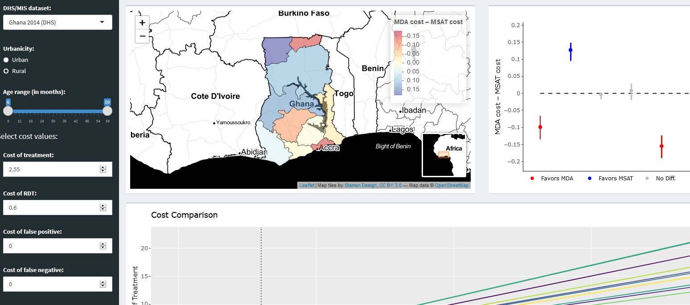 -->
<!-- ``` -->

<!-- <small>Millar, J., Toh, K.B. & Valle, D. To screen or not to screen: an interactive framework for comparing costs of mass malaria treatment interventions. BMC Med 18, 149 (2020).</small> -->

<!-- --- -->

### Predict Causes of Childhood Febrile Illness

Symptoms, demographic and hematological variables as predictors. Bayesian Model Averaging approach. (http://bit.ly/ben-afi-app)

```{r echo=FALSE, fig.align='center'}
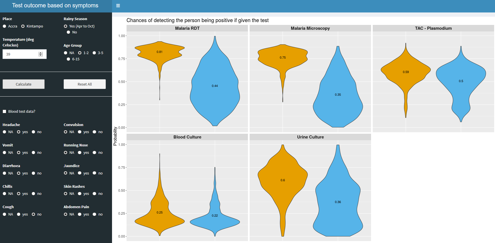
```

<!-- --- -->
<!-- # Section remarks -->

<!-- - Correlation $\ne$ causation -->

<!-- - Emphasis on "usability": e.g. small, fast, flexible -->

<!-- - "Modeler-initiated" approach, does it work? -->

---
class: inverse, center, middle

# Part III Agent-based Model of COVID-19 Transmission in Florida

---
# Hladish Lab

```{r echo=FALSE, out.width = "80%", fig.align='center'}
knitr::include_graphics("../assets/img/hladishlab.png")
```

---
# COVID-19 Agent-based Model for Florida

```{r echo=FALSE, fig.align='center'}
knitr::include_graphics("../assets/img/abm_schema.png")
```

---
# Use of ABM

- Control and reopening strategy (MIDAS Multi-Model Outbreak Decision Support; submitted to *Science*)

- Effects of vaccination (efficacy and coverage)

- Spatial distribution and urban-rural divide of COVID-19

---
# Two Dynamics

```{r echo=FALSE, out.width="78%", fig.align='center'}
knitr::include_graphics("../assets/img/flcovid-RCHD.png")
```

---
# Two Dynamics

```{r echo=FALSE, fig.align='center'}
knitr::include_graphics("../assets/img/abc_schema2.png")
```

---
# Reporting

- Quantify relative improvement in case detection

- Excess death, hospitalization-death dynamic varied over time

```{r echo=FALSE, fig.align='center'}
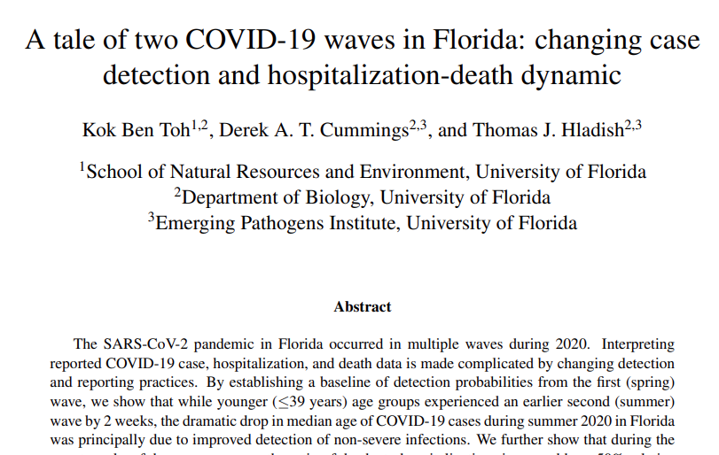
```

---
# Personal Protective Behaviour (PPB)

- Important part of COVID-19 transmission dynamic

- Using a simple 0-1 score to describe behavioural changes

- Intertwined with mobility, policy intervention, social distancing, hand washing, masking etc

- Affects disease transmissibility and inter-household interaction network in the model

- Time-varying, need to parameterize using proxy such as “mobility index”

---
# SafeGraph Mobility

.pull-left1[
- Provides estimates of foot traffic to “point of interests” down to census block group level

- Social distancing metrics, e.g. proportion of time at home 🏠
]

.pull-right1[
```{r echo=FALSE, fig.align='center'}
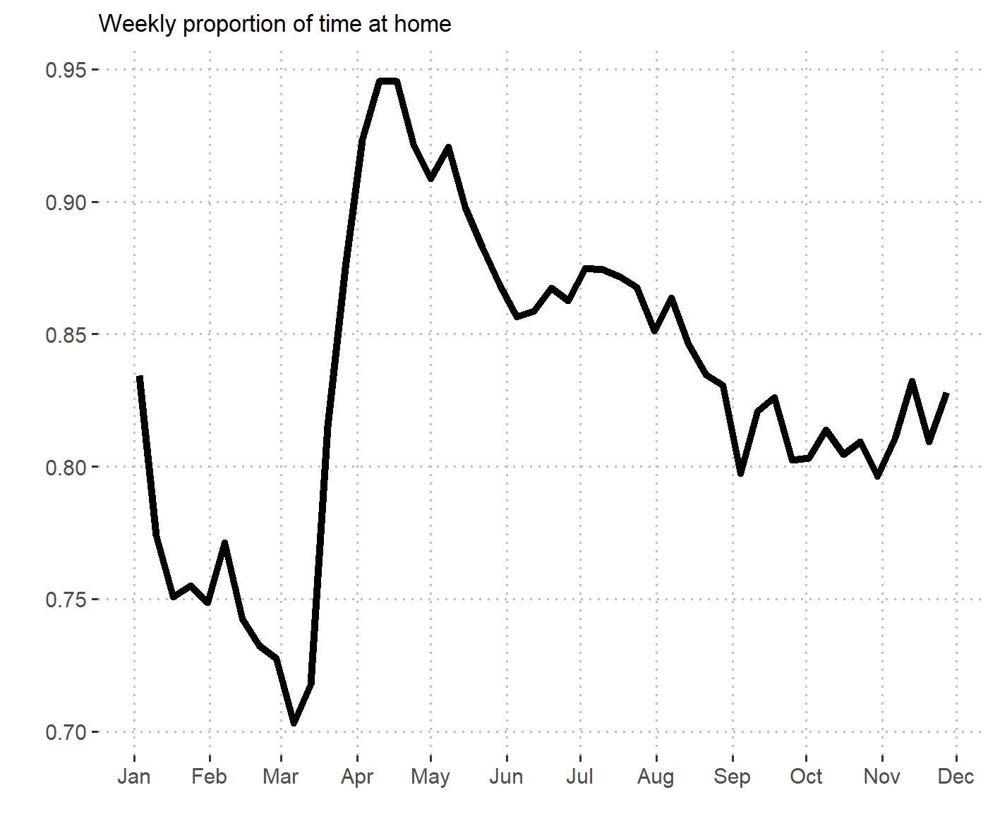
```
]

---
# Problem...

```{r echo=FALSE, out.width="70%", fig.align='center'}
knitr::include_graphics("../assets/img/case_vs_sgnah.png")
```

- No clear change in behaviour during second wave

- How did second wave go down without PPB change?

- Herd immunity?

---
# Search for other PPB proxy

- Cuebiq contact index

```{r echo=FALSE, fig.align='center'}
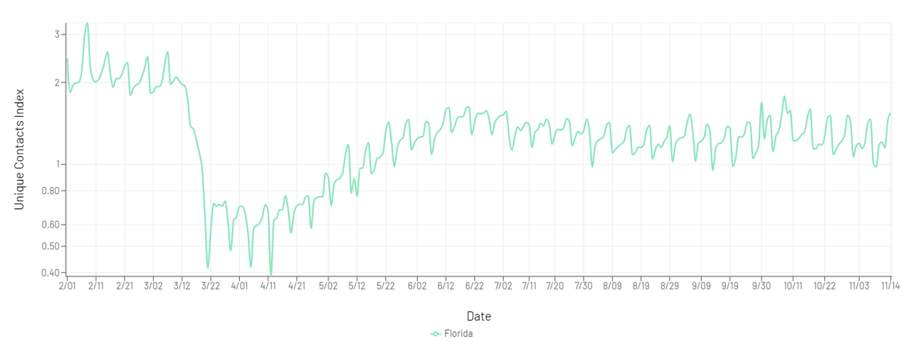
```

---
# Search for other PPB proxy

- Bars and restaurants “index”

- Mask wearing behaviour: e.g. Imperial College YouGov Behaviour tracker

- Composite index?

---
# Work in progress...

- Disentangling the interaction between mobility and age, and incorporating them in the model

```{r echo=FALSE, out.width="80%", fig.align='center'}
knitr::include_graphics("../assets/img/SG_TAH_Age.png")
```

---
# References

- Schoeps, Anja, et al. "The Effect of Distance to Health-Care Facilities on Childhood Mortality in Rural Burkina Faso", American Journal of Epidemiology 173, 5 (2011), pp. 492--498.
- Kizito, James, et al. "Improving access to health care for malaria in Africa: a review of literature on what attracts patients", Malaria Journal 11, 1 (2012), pp. 55.
- Weiss, D.J. et al. 2019. Mapping the global prevalence, incidence, and mortality of Plasmodium falciparum, 2000–17: a spatial and temporal modelling study. Lancet 394: 322–331.
- Mandal, S. et al. Mathematical models of malaria - a review. Malar J 10, 202 (2011).
- Millar, J. et al. 2018. Detecting local risk factors for residual malaria in northern Ghana using Bayesian model averaging. Malar. J. 17: 343.
- Amratia, P. et al. 2019. Characterizing local-scale heterogeneity of malaria risk: A case study in Bunkpurugu-Yunyoo district in northern Ghana. Malar. J. 18: 1–14.

---
class: inverse, center, middle

# Thank you very much! 
Feedback, comments and questions? Email: kokbent [at] ufl.edu