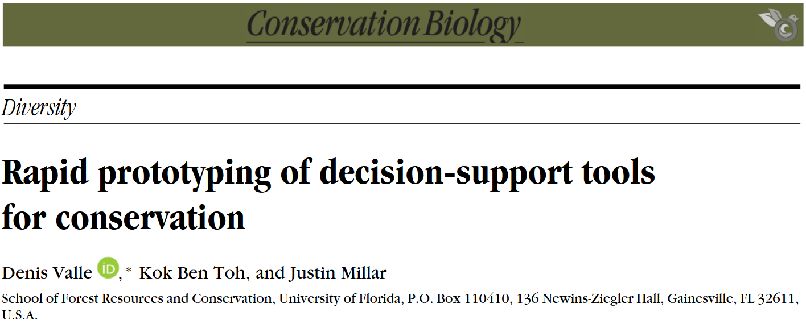
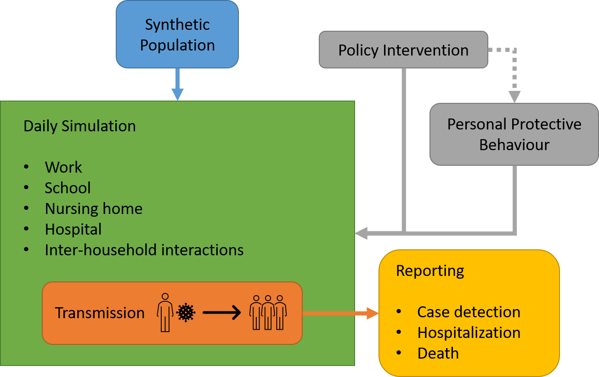
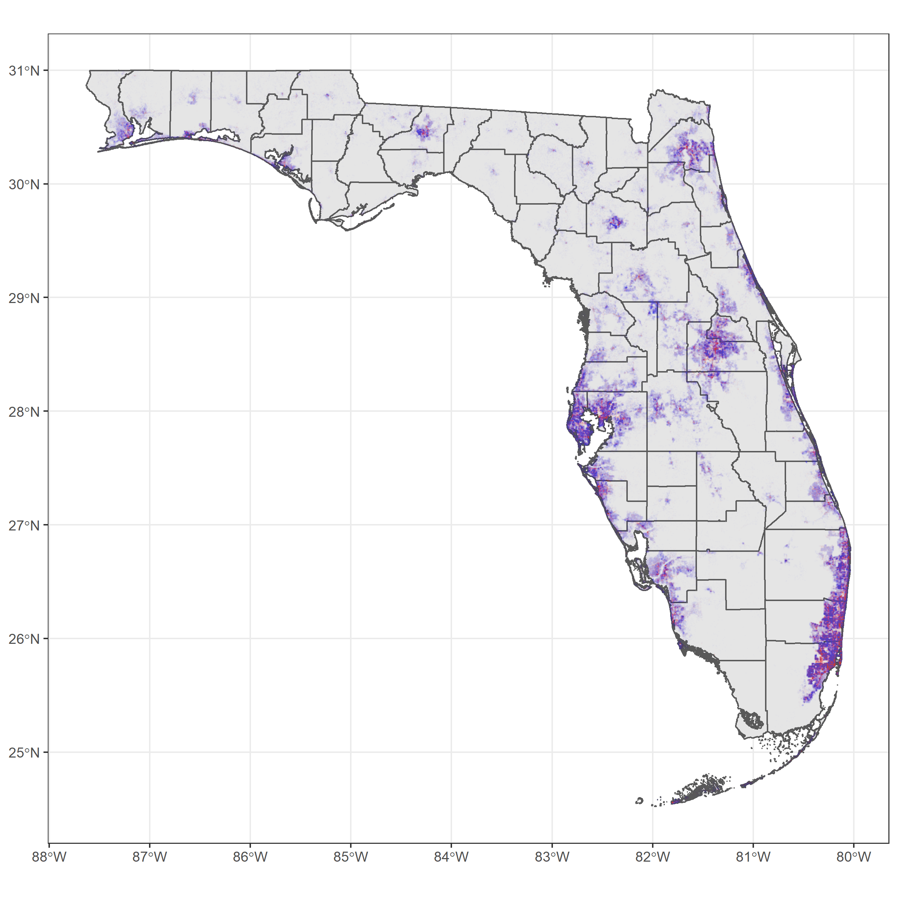
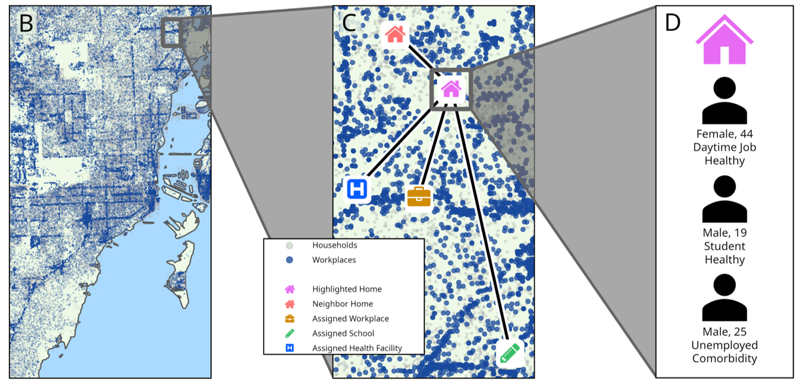
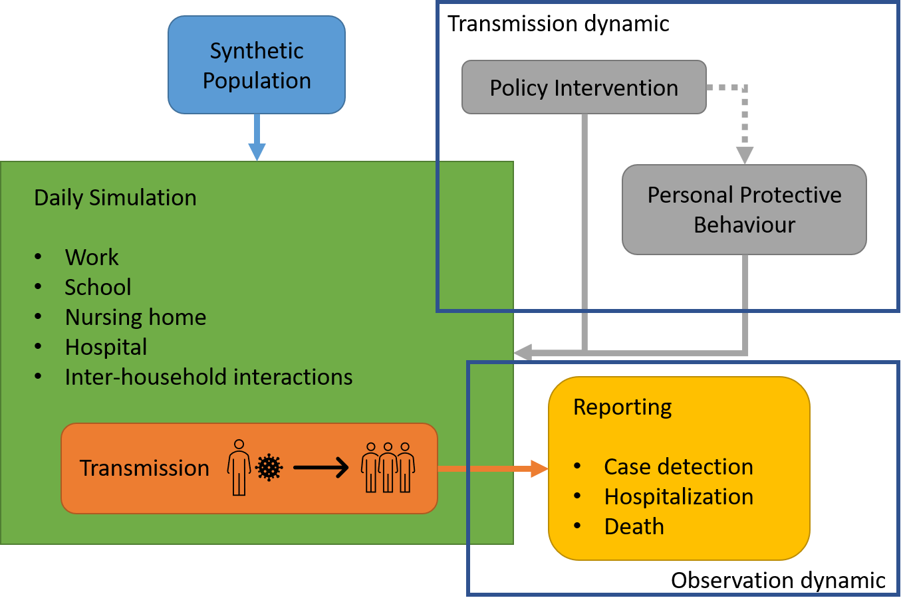
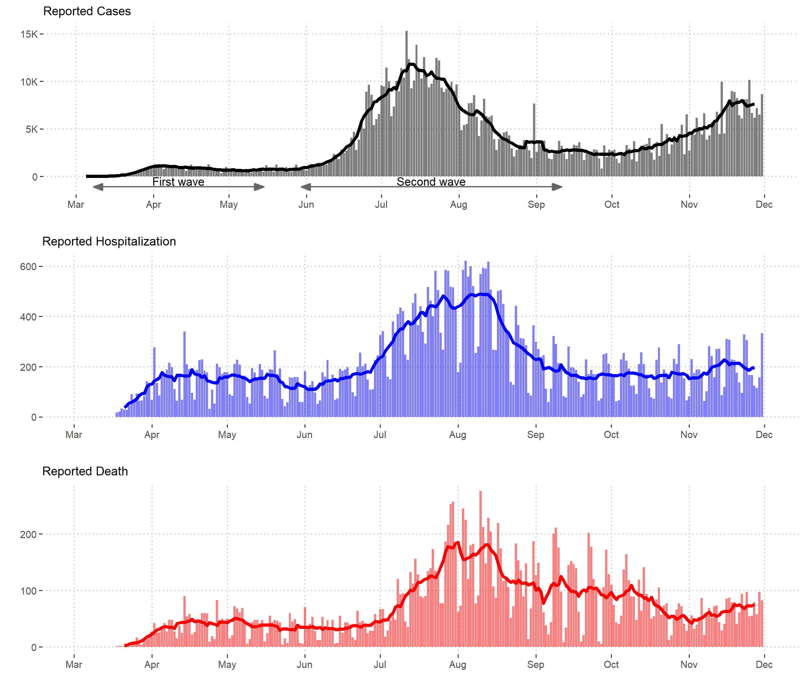
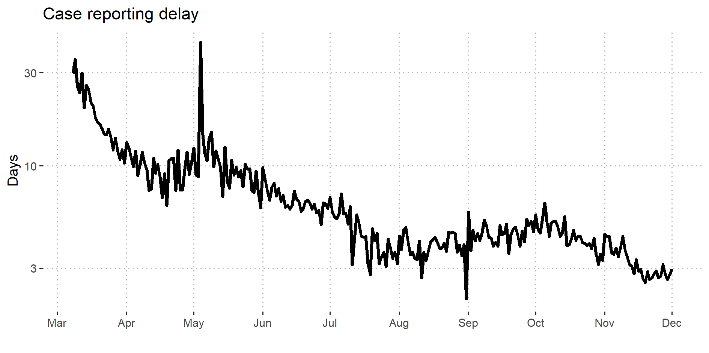
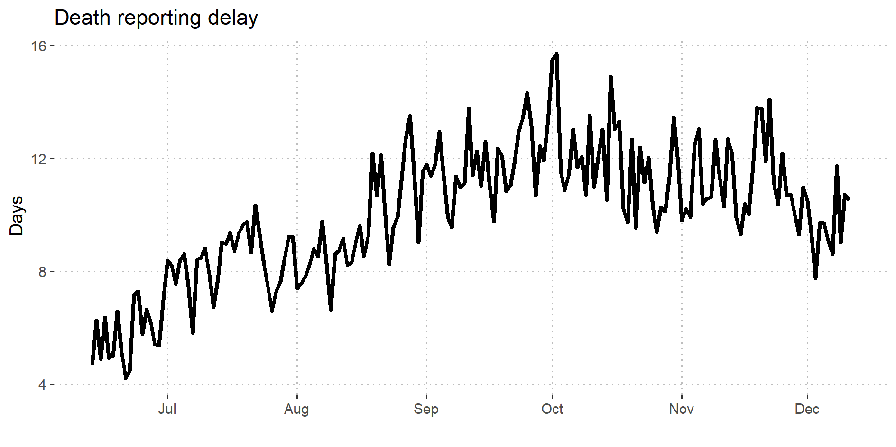
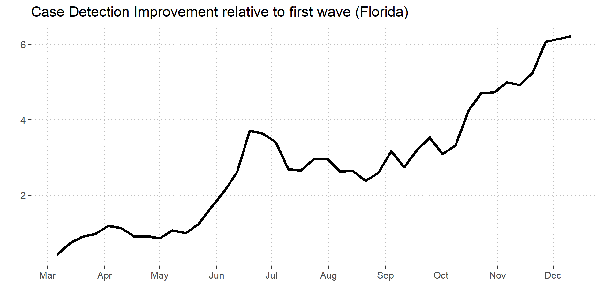

# PhD dissertation

### Improving National Level Spatial Mapping of Malaria through Alternative Spatial and Spatio-temporal Models

### Guiding placement of health facilities using malaria criteria and interactive tools

### Decision Support Tool to Predict Causes of Childhood Febrile Illness Using a Bayesian Model Approach

---
# Overview

### Part I: Guiding placement of health facilities using malaria criteria and interactive tools

### Part II: Agent-based Model of COVID-19 Transmission in Florida

---
class: inverse, center, middle

# Part I: Guiding placement of health facilities using malaria criteria and interactive tools

---
# Interactive tools

- Bridging the gap between modelers and stakeholders

- Enhance understanding of the models by "using" them

- Informed decisions

- Increasingly easy to create: No longer requires in-depth knowledge in Javascript and CSS

```{r echo=FALSE, fig.align='center'}
#
```

---
# Placement of health facilities

- Early diagnosis and treatment of malaria reduce death and transmission

- Many factors contribute to access to healthcare

- Distance or travel time to health facilities is important predictor to malaria prevalence *(e.g. Schoeps et al. 2011, Kizito et al. 2012)*

---
# Bunkpurugu-Yunyoo District, Ghana

.pull-left1[
- 1200 km $^2$ , 150K populations

- 2 urban centers, 8 health facilities

- Multiple years of malaria surveys in 2010 - 2014

- Important predictors *(Amratia et al. 2019; Millar et al. 2018)*
  - Distance to health facilities (HF)
  - Distance to urban centers
]

.pull-right1[
```{r echo=FALSE, fig.align='center'}
knitr::include_graphics("../assets/img/byd-simplemap.png")
```
]

---
# Objectives

Determine the optimal locations for new health facilities based on district-wide malaria criteria:

  1. Overall malaria prevalence of children under 5, 
  
  2. Overall malaria incidence of all ages, and 
  
  3. Average travel time to nearest health facilities
  
---
# Methods

- Three years of high transmission season data (2010 to 2012)

- ~ 5000 children under five

- 71 to 80 villages per year

- GAM with 5 predictors
  - Travel time to HF, distance to urban center, elevation, NDVI, log population density

- Use Genetic Algorithm to find optimal locations given number of health facilities and criteria

---
# Results

See interactive visualizer and simulator created.
- http://bit.ly/ben-hf-app

---
# Take home messages

- Different optimization criteria can produce very different results.

- Importance of using multiple optimization criteria in decision analysis.

- Decision analysis and interactive application are important tools for communicating models.

---
class: inverse, center, middle

# Part II Agent-based Model of COVID-19 Transmission in Florida

---
# Hladish Lab

```{r echo=FALSE, out.width = "80%", fig.align='center'}

```

---
# COVID-19 Agent-based Model for Florida

```{r echo=FALSE, fig.align='center'}

```

---
# Synthetic population

.pull-left[
- 20.6m population

- 8.9m households

- 2.3m workplaces

- Schools, long term care facilities, hospitals
]

.pull-right[
```{r echo=FALSE}

```
]

---
# Synthetic population

```{r echo=FALSE, out.width="100%", fig.align='center'}

```

---
# Two Dynamics

```{r echo=FALSE, fig.align='center'}

```

---
class: center, middle

Transmission dynamic ❓ + Observation process 😐 = Reported data 🙂

---
# Reported data

```{r echo=FALSE, out.width = "80%", fig.align='center'}

```

---
# Observation dynamics

```{r echo=FALSE, fig.align='center'}

```

---
# Observation dynamics

```{r echo=FALSE, fig.align='center'}

```

---
# Observation dynamics

```{r echo=FALSE, fig.align='center'}

```

---
# Use of ABM

- Effects of vaccination

- Effects of more transmissible and pathogenic variants

- Spatial distribution and urban-rural divide of COVID-19

---
# References

- Schoeps, Anja, et al. "The Effect of Distance to Health-Care Facilities on Childhood Mortality in Rural Burkina Faso", American Journal of Epidemiology 173, 5 (2011), pp. 492--498.
- Kizito, James, et al. "Improving access to health care for malaria in Africa: a review of literature on what attracts patients", Malaria Journal 11, 1 (2012), pp. 55.
- Weiss, D.J. et al. 2019. Mapping the global prevalence, incidence, and mortality of Plasmodium falciparum, 2000–17: a spatial and temporal modelling study. Lancet 394: 322–331.
- Millar, J. et al. 2018. Detecting local risk factors for residual malaria in northern Ghana using Bayesian model averaging. Malar. J. 17: 343.
- Amratia, P. et al. 2019. Characterizing local-scale heterogeneity of malaria risk: A case study in Bunkpurugu-Yunyoo district in northern Ghana. Malar. J. 18: 1–14.

---
class: inverse, center, middle

# Thank you very much! 
Feedback, comments and questions? 
- Email: kokbent [at] ufl.edu
- Website https://bentoh.my