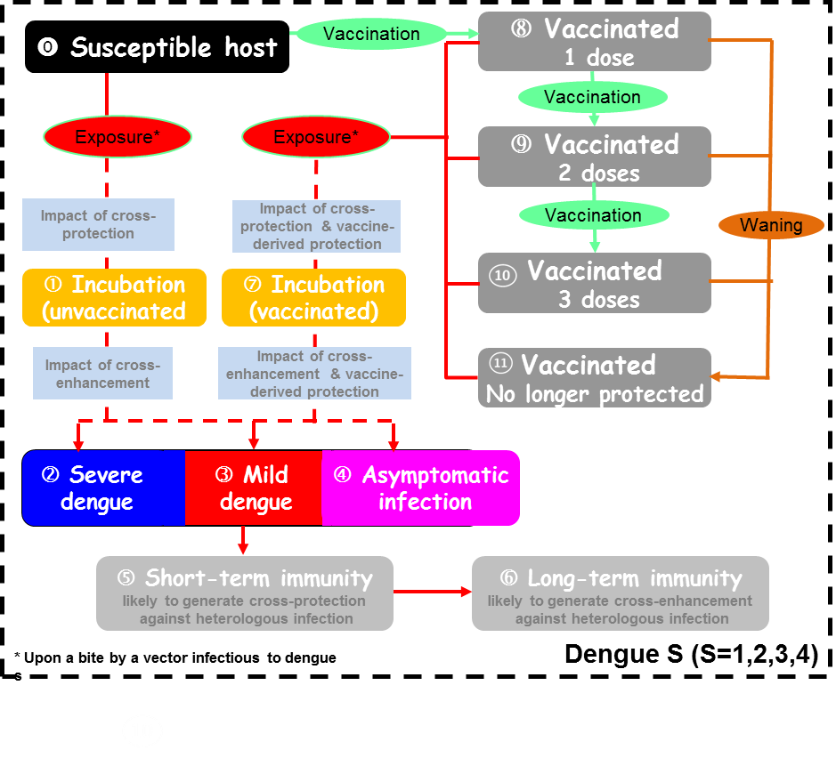

class: inverse, center, middle

# Research work that I am proud of

---
# COVID-19 Transmission Model in Florida

- Spatially explicit agent-based model
  - Assess impact of intervention strategies (e.g. selective lockdown / closure of businesses)
  - Assess impact of vaccinations

- Synthetic populations

- Inference of time-varying parameters

---
# Synthetic Populations of Florida
.pull-left[
- 8.9m households, 20m persons, 2.4m workplaces

- Nursing homes, schools and hospitals

- Statistics and randomization
  - e.g. workplace sizes
  - e.g. 'gravity model' for connections
]

.pull-right[
One household (lightgreen) and its connected locations

```{r echo=FALSE}
knitr::include_graphics("../assets/img/singlehh.PNG")
```
]
---
class: center, middle
.pull-left[
```{r echo=FALSE}
knitr::include_graphics("../assets/img/hhwp.png")
```
]

.pull-right[
```{r echo=FALSE}
knitr::include_graphics("../assets/img/workdist.png")
```
]

---
# Inference of time varying parameters

- State/county reported cases, hospitalization and death
- Report delay of test results (State line list)
- Social distancing metric (Safegraph cellphone tracking data)

```{r echo=FALSE, out.width="90%", fig.align='center'}
knitr::include_graphics("../assets/img/counties-sdm.png")
```

---
# Impact?

.pull-left[
```{r echo=FALSE}
knitr::include_graphics("../assets/img/Vaccine.png")
```
]

.pull-right[
```{r echo=FALSE}
knitr::include_graphics("../assets/img/Vaccine2.png")
```
]

---
class: inverse, center, middle

# Paper Critique

---
# Paper Critique

- Coudeville, L, Baurin, N, Shepard, DS, (2020) The potential impact of dengue vaccination with, and without, pre-vaccination screening. *Vaccine* 38(6):1363-1369.

- Assess the benefit and cost effectiveness of "screen and vaccinate" strategy of CYD-TDV vaccine at individual and population level.
  - Under different transmission settings and screening test sensitivities.
  
- Beneficial on the individual level

- Lower negative impact on population level than that of vaccinate without screening

- Cost-effective except in very low transmission setting

---
# Paper Critique

.pull-left[
- Deterministic compartmental model: Complex and comprehensive
  - Account for cross protection, cross enhancement, waning of immunity, stages of infections
]

.pull-right[
```{r echo=FALSE}

```
]

- Unclear about performance of the model (e.g. validation)
  
---
# Paper Critique

- Detailed breakdown of cost on health system and social perspective

```{r echo=FALSE, out.width="60%", fig.align='center'}
knitr::include_graphics("../assets/img/1-s2.0-S0264410X19316548-gr6_lrg.jpg")
```

- In light of Dengvaxia incident in the Philippines, hard to imagine vaccination without screening in anywhere even in area with very low transmission.

- Will be interesting to see how the analyses translate into country-level operations, taking heterogeneity in transmission and costs into account.

---
class: inverse, center, middle

# Thank you!
