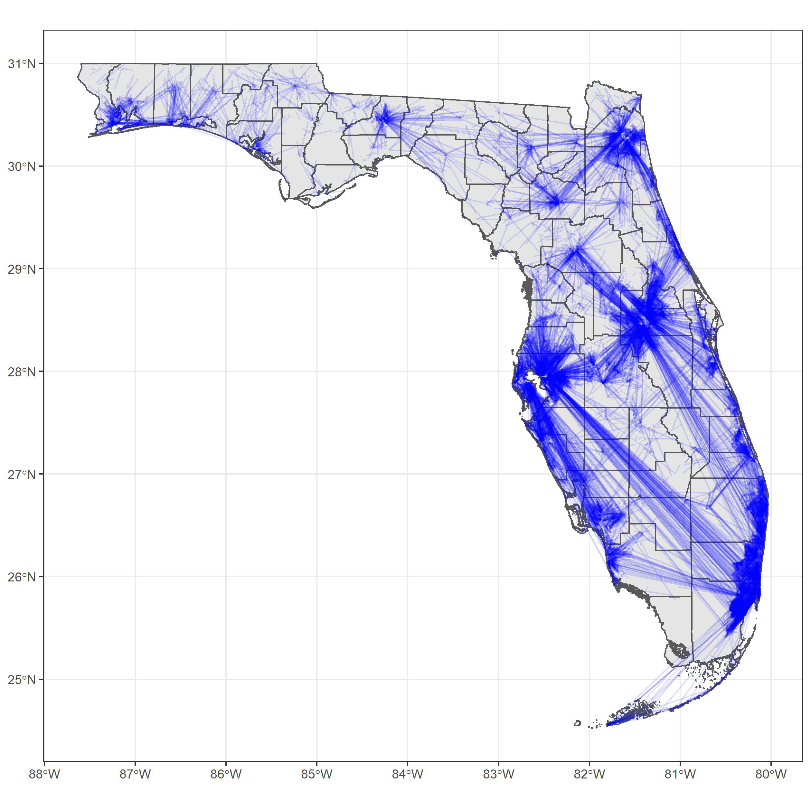
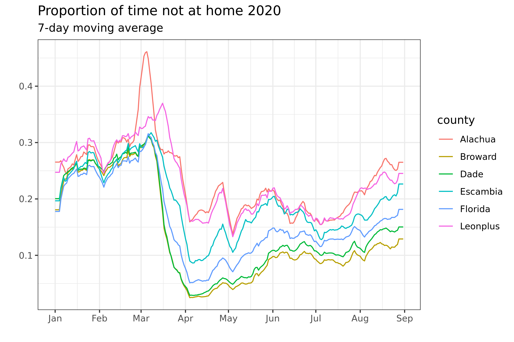
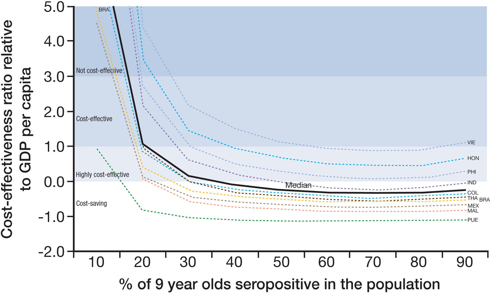

class: inverse, center, middle

# Research work that I am proud of

---
# COVID-19 Transmission Model in Florida

- Spatially explicit, stochastic and discrete-time agent-based model

--

- Foundation: synthetic populations
  - Persons (Age, sex, comorbidities)
  - Locations (Workplace, schools, nursing homes, hospitals)
  - Connections (reside, work, school, socialize via household network)

--

- 8.9m households, 20m persons, 2.4m workplaces
- Statistics and randomization
  - e.g. workplace sizes, 'gravity model' for connections

---
class: center, middle

```{r echo=FALSE, out.width="80%"}
knitr::include_graphics("../assets/img/hhwp.png")
```

---
class: center, middle

```{r echo=FALSE, out.width="80%"}

```

---
# Inference of time varying parameters
- State/county reported cases, hospitalization and death
- Report delay of test results (State line list)
- Social distancing metric (Cellphone tracking data)

```{r echo=FALSE, out.width="90%", fig.align='center'}

```

---
# Use of model
- Assess impact of vaccination
- Assess impact of other intervention strategies (e.g. lockdown, contact tracing)
- Learn urban-rural dynamic

```{r echo=FALSE, out.width="70%", fig.align='center'}
knitr::include_graphics("../assets/img/Vaccine.png")
```

---
class: inverse, center, middle

# Paper Critique

---
# Paper Critique

- Coudeville, L, Baurin, N, Shepard, DS, (2020) The potential impact of dengue vaccination with, and without, pre-vaccination screening. *Vaccine* 38(6):1363-1369.

- Assess the benefit and cost effectiveness of "screen and vaccinate" strategy of CYD-TDV vaccine at individual and population level.
  - Under different transmission settings and screening test sensitivities.
  
- Screen and vaccinate is beneficial on the individual level, and yielded lower negative impact on population level than that of vaccinate without screening

- Cost-effective except in very low transmission setting

---
# Paper Critique

- Deterministic compartmental model: Very comprehensive with a lot of compartments and states
  - Accounting for cross protection, cross enhancement, waning of immunity and four stages of infections

- Unclear about performance of the model with respect to the past datasets
  - Mentioned in 2016 paper discussing model parameterisation
  
---
# Paper Critique

- Detailed breakdown of cost on health system and social perspective

```{r echo=FALSE, out.width="50%", fig.align='center'}

```

- Wide range of vaccination consideration (e.g. continual screening, dosages)

- In light of Dengvaxia incident in the Philippines, hard to imagine vaccination without screening in anywhere even in area with very low transmission

- Will be interesting to see what the model means on country-level operations, taking heterogeneity in transmission and costs into account.

---
class: inverse, center, middle

# Thank you!
