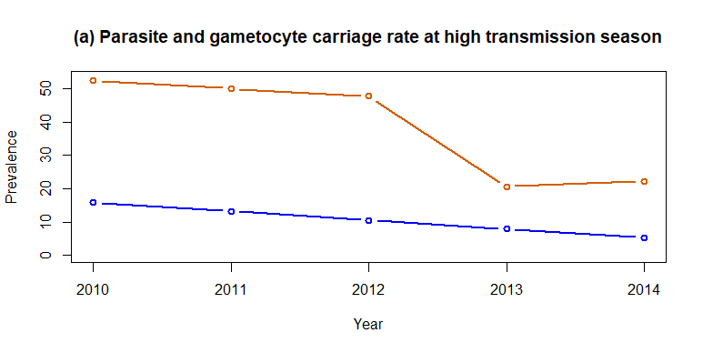
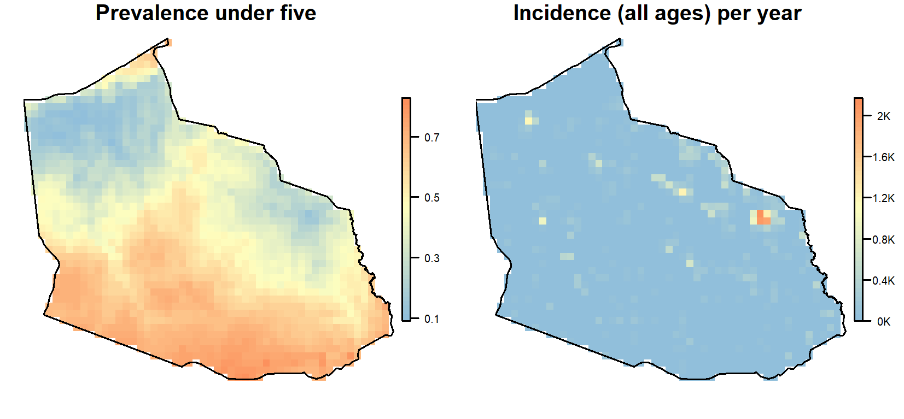
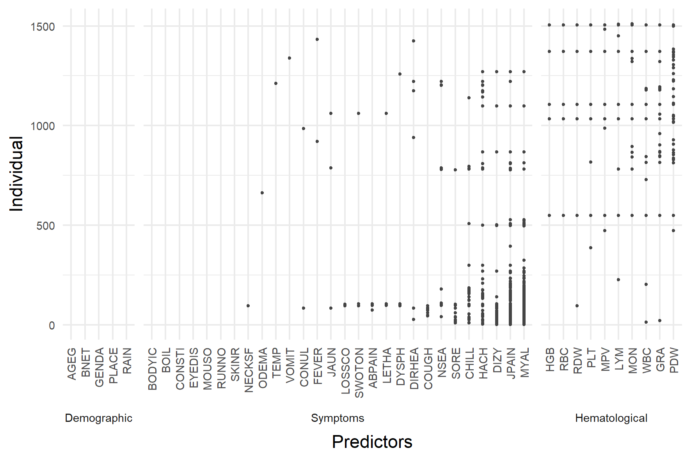
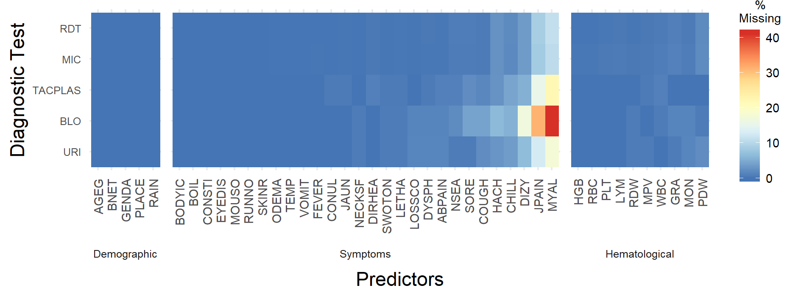
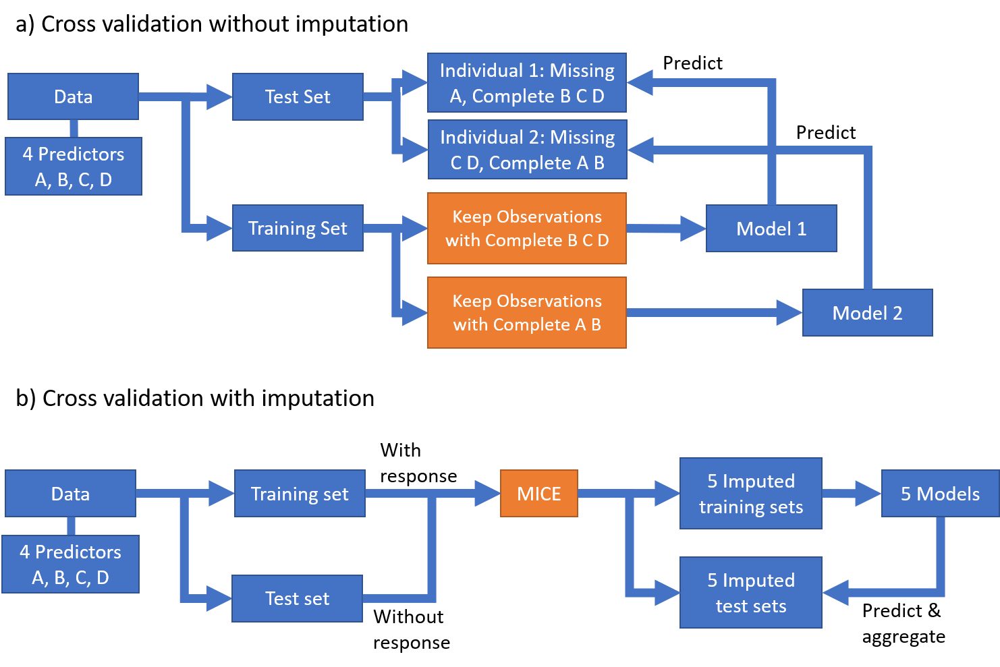
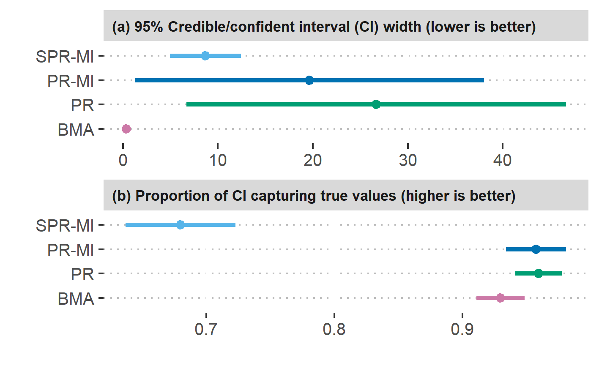
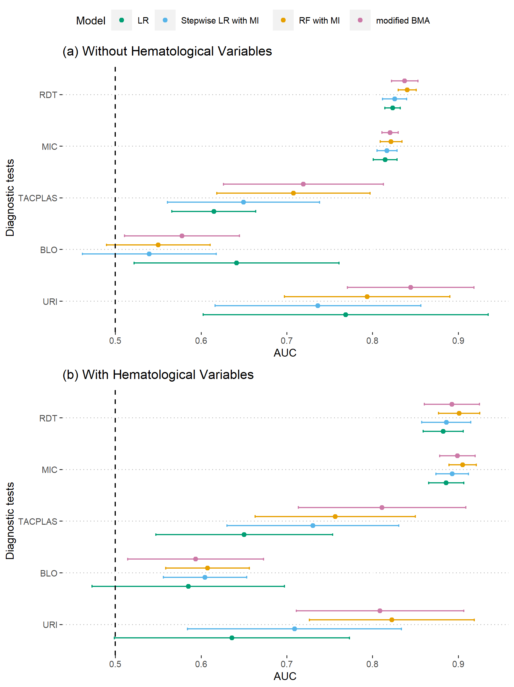

# Additional Analysis for Part 1

- [Supplemental A: Further investigations of GAM and SPDE-INLA performance](SI_A.pdf)

- [Supplemental B: Significant predictors and malaria prevalence maps by model](SI_B.pdf)

---
# Part 2: Overall prevalence

```{r echo=FALSE, fig.align='center'}

```

---
# Part 2: Prevalence vs Incidence

```{r echo=FALSE, fig.align='center'}

```

---
# Part 3: AFI Data Missingness

```{r echo=FALSE, fig.align='center'}

```

```{r echo=FALSE, fig.align='center'}

```

---
# Part 3: CV Schema

```{r echo=FALSE, fig.align='center'}

```

---
# Part 3: Inference results

```{r echo=FALSE, fig.align='center'}

```

---
# Part 3: AUC Comparisons

```{r echo=FALSE, fig.align='center', out.width="50%"}

```
