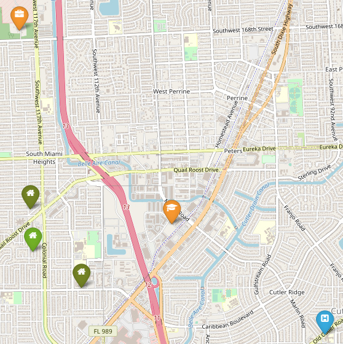
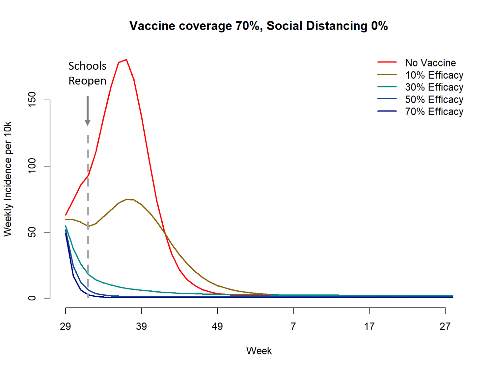

class: inverse, center, middle

# Curriculum

---
# Academic background

**2016 to Dec 2020** PhD Interdisciplinary Ecology, University of Florida
  - Comparison of spatial/spatiotemporal malaria mapping models
  - Guiding placement of health facilities using malaria criteria and interactive tool
  - Decision support tool to predict causes of childhood febrile illness using a Bayesian model approach
  
**2017 to 2019** MSc Statistics, University of Florida

**2008 to 2010** MSc Biology, National University of Singapore
  - Evaluating determinants of camouflage using computer simulation and human predators

**2003 to 2007** BSc (Hons) Life Sciences, National University of Singapore 

---
class: inverse, center, middle

# Scientific project walkthrough

---
# COVID-19 Transmission Model in Florida

- Spatially explicit agent-based model
  - Assess impact of intervention strategies (e.g. selective lockdown / closure of businesses)
  - Assess impact of vaccinations

- Synthetic populations

- Inference of time-varying parameters

---
# Synthetic Populations of Florida
.pull-left[
- 8.9m households, 20m persons, 2.4m workplaces

- Nursing homes, schools and hospitals

- Statistics and randomization
  - e.g. workplace sizes
  - e.g. 'gravity model' for connections
]

.pull-right[
One household (lightgreen) and its connected locations

```{r echo=FALSE}

```
]
---
class: center, middle
.pull-left[
```{r echo=FALSE}
knitr::include_graphics("../assets/img/hhwp.png")
```
]

.pull-right[
```{r echo=FALSE}
knitr::include_graphics("../assets/img/workdist.png")
```
]

---
# Inference of time varying parameters

- State/county reported cases, hospitalization and death
- Report delay of test results (State line list)
- Social distancing metric (Safegraph cellphone tracking data)

```{r echo=FALSE, out.width="90%", fig.align='center'}
knitr::include_graphics("../assets/img/counties-sdm.png")
```

---
# Impact?

.pull-left[
```{r echo=FALSE}
knitr::include_graphics("../assets/img/Vaccine.png")
```
]

.pull-right[
```{r echo=FALSE}

```
]

---
class: inverse, center, middle

# Thank you!
