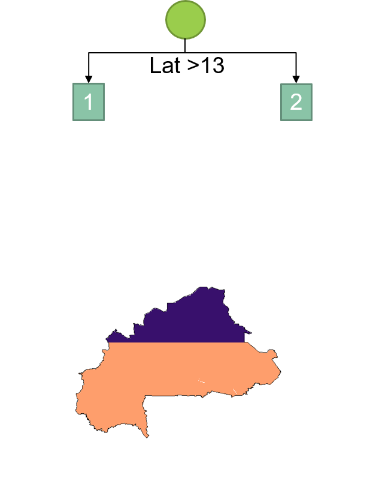
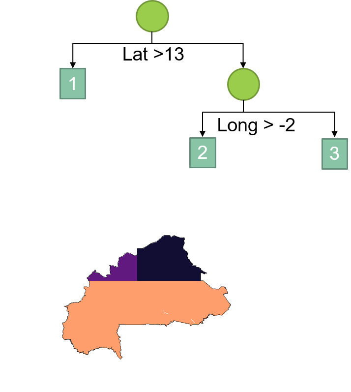

class: inverse, center, middle

# Introduction to Malaria

---

---
# Overview

- Improving National Level Spatial Mapping of Malaria through Alternative Spatial and Spatio-temporal Models

- Interlude 1

- Guiding placement of health facilities using malaria criteria and interactive tool

- Interlude 2

- Decision Support Tool to Predict Causes of Childhood Febrile Illness Using a Bayesian Model Approach

---
class: inverse, center, middle

# Improving National Level Spatial Mapping of Malaria through Alternative Spatial and Spatio-temporal Models

---
# Mapping malaria

- Malaria risk map guides efficient resource allocation for intervention program 

```{r echo=FALSE}
knitr::include_graphics("../assets/img/malaria-risk-bf-intro.png")
```

---
# Ingredients

- National Malaria Survey Data

- Spatial predictors

  - Temperature
  - Rainfall
  - Nighttime lights
  - Accessibility to urban centers
  - Elevation
  - etc.

--

- And a model...

---
# Choice of Model

- Most common approach: Gaussian Process Model
  - Points close to the observed data point should share similar prevalence

```{r echo=FALSE, out.width="80%", fig.align='center'}
knitr::include_graphics("../assets/img/gp-correl.gif")
```

  - Time consuming as sampling point large
  - Commonly approximated using Stochastic Partial Differential Equation (SPDE) + Integrated Nested Laplace Approximation (INLA)

---
# Alternative model?

- Spatial smoothing using Generalized Additive Model (GAM)
  - An underlying smoothed "landscape" unexplained by the covariates

```{r echo=FALSE, out.width="70%", fig.align='center'}
knitr::include_graphics("../assets/img/gam-smoothed.png")
```

---
# Machine learning?

- Decision tree

```{r echo=FALSE, out.width="40%", fig.align='center'}

```

---
# Machine learning?

- Decision tree

```{r echo=FALSE, out.width="45%", fig.align='center'}

```

---
# Machine learning?

- Decision tree

```{r echo=FALSE, out.width="50%", fig.align='center'}
knitr::include_graphics("../assets/img/gbm-schema3.png")
```

---
# Machine learning?

.pull-left[
- Decision-trees ensemble methods

- E.g. Random forests, gradient boosting tree/method (GBM)
]

.pull-right[
```{r echo=FALSE, out.width="50%", fig.align='center'}
knitr::include_graphics("../assets/img/spde-gamgbm-length.png")
```
]

---
# Borrow strength from the past?

- More and more countries now have multiple years of national malaria survey data.
  - e.g. Burkina Faso 2010 vs 2014

- Spatial vs Spatiotemporal setting

```{r echo=FALSE, out.width="90%", fig.align='center'}
knitr::include_graphics("../assets/img/temporal-choice.png")
```

---
# Objectives

- To determine if GAM and state-of-the-art machine learning method (e.g. GBM), under both spatial and spatio-temporal setting, can be good alternatives to the more complicated SPDE method

- To determine if inclusion of past data is beneficial in modeling the current spatial distribution of malaria prevalence at the national scale

---
# Model comparison

- Ten-fold cross-validation

- 4 models (SPDE, GAM, GBM and stepwise logistic regression)

- 2 settings (Spatial vs Spatiotemporal)

- 5 countries (Burkina Faso, Malawi, Mali, Nigeria, Uganda)

- 2 metrics (Log-likelihood and Mean Absolute Error, MAE)

---
# Results


