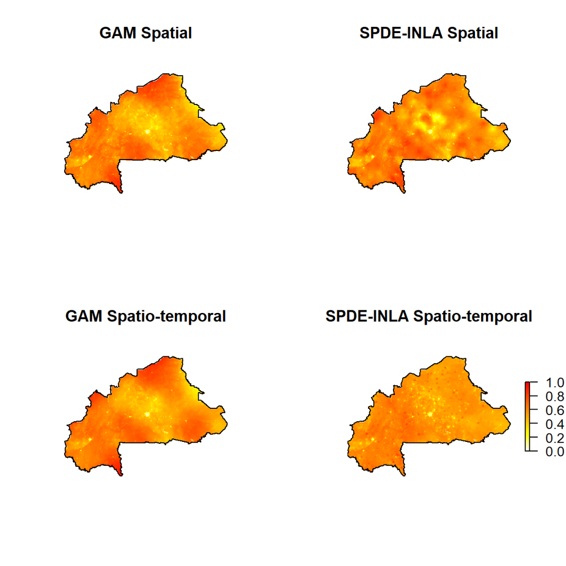
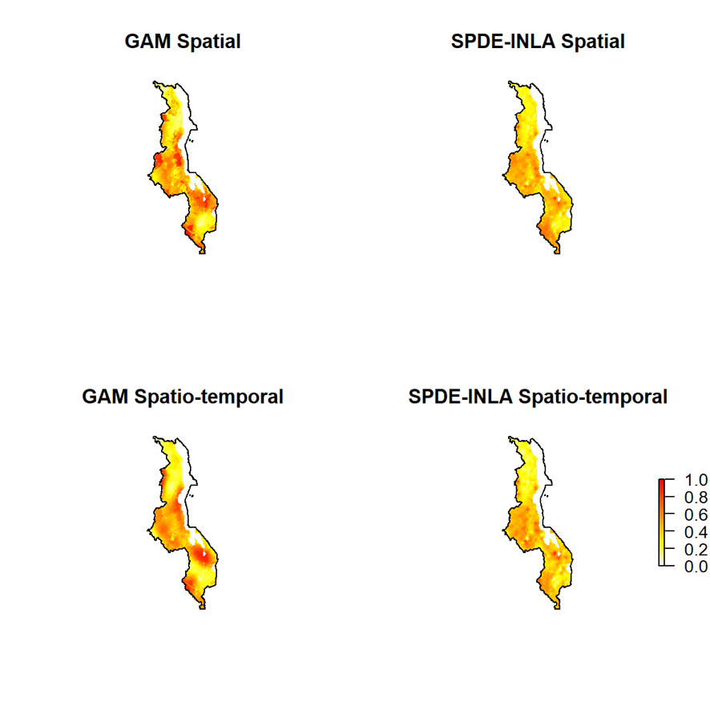

class: inverse, center, middle

# Introduction to Malaria

---
# Introduction to Malaria

.pull-left1[
- Caused by protozoan parasite *Plasmodium*

- 4 + 1 species that causes human malaria
  - *P. falciparum* most prevalent in Africa

- Mosquito-borne disease
]

.pull-right1[
```{r echo=FALSE, fig.align='center'}
knitr::include_graphics("../assets/img/malaria-life-cycle.jpg")
```
.footnote[Picture source: [Johns Hopkins Bloomberg School of Public Health](http://ocw.jhsph.edu)]
]

---
# Stats and Geography

- 230 million cases worldwide in 2018; 400k death, 2/3 under 5 years old

- Distribution of disease
  - Tropics: Sub-Saharan Africa, South and Southeast Asia, Latin America
  - Correlated to environmental and socio-economic factors
  
```{r echo=FALSE, out.width="95%", fig.align='center'}
knitr::include_graphics("../assets/img/world-malaria-map.png")
```
.footnote[Picture source: [Malaria Atlas Project](https://malariaatlas.org/)]

---
# Overview

- Improving National Level Spatial Mapping of Malaria through Alternative Spatial and Spatio-temporal Models

- Interlude 1

- Guiding placement of health facilities using malaria criteria and interactive tool

- Interlude 2

- Decision Support Tool to Predict Causes of Childhood Febrile Illness Using a Bayesian Model Approach

---
class: inverse, center, middle

# Improving National Level Spatial Mapping of Malaria through Alternative Spatial and Spatio-temporal Models

---
# Mapping malaria

- Malaria risk map guides efficient resource allocation for intervention program 

```{r echo=FALSE}
knitr::include_graphics("../assets/img/malaria-risk-bf-intro.png")
```

---
# Ingredients

- National Malaria Survey Data

- Spatial predictors

  - Temperature
  - Rainfall
  - Nighttime lights
  - Accessibility to urban centers
  - Elevation
  - etc.

--

- And a model...

---
# Choice of Model

- Most common approach: Gaussian Process Model
  - Points close to the observed data point should share similar prevalence

```{r echo=FALSE, out.width="80%", fig.align='center'}
knitr::include_graphics("../assets/img/gp-correl.gif")
```

  - Time consuming as sampling point large
  - Commonly approximated using Stochastic Partial Differential Equation (SPDE) + Integrated Nested Laplace Approximation (INLA)

---
# Alternative model?

- Spatial smoothing using Generalized Additive Model (GAM)
  - An underlying smoothed "landscape" unexplained by the covariates

```{r echo=FALSE, out.width="70%", fig.align='center'}
knitr::include_graphics("../assets/img/gam-smoothed.png")
```

---
# Machine learning?

- Decision tree

```{r echo=FALSE, out.width="40%", fig.align='center'}
knitr::include_graphics("../assets/img/gbm-schema1.png")
```

---
# Machine learning?

- Decision tree

```{r echo=FALSE, out.width="45%", fig.align='center'}
knitr::include_graphics("../assets/img/gbm-schema2.png")
```

---
# Machine learning?

- Decision tree

```{r echo=FALSE, out.width="50%", fig.align='center'}
knitr::include_graphics("../assets/img/gbm-schema3.png")
```

---
# Machine learning?

.pull-left[
- Decision-trees ensemble methods

- E.g. Random forests, gradient boosting tree/method (GBM)
]

.pull-right[
```{r echo=FALSE, out.width="50%", fig.align='center'}
knitr::include_graphics("../assets/img/spde-gamgbm-length.png")
```
]

---
# Borrow strength from the past?

- More and more countries now have multiple years of national malaria survey data.
  - e.g. Burkina Faso 2010 vs 2014

- Spatial vs Spatiotemporal setting

```{r echo=FALSE, out.width="90%", fig.align='center'}
knitr::include_graphics("../assets/img/temporal-choice.png")
```

---
# Objectives

- To determine if GAM and state-of-the-art machine learning method (e.g. GBM), under both spatial and spatio-temporal setting, can be good alternatives to the more complicated SPDE method

- To determine if inclusion of past data is beneficial in modeling the current spatial distribution of malaria prevalence at the national scale

---
# Model comparison

- Ten-fold cross-validation

- 4 models (SPDE, GAM, GBM and stepwise logistic regression)

- 2 settings (Spatial vs Spatiotemporal)

- 5 countries (Burkina Faso, Malawi, Mali, Nigeria, Uganda)

- 2 metrics (Log-likelihood and Mean Absolute Error, MAE)

---
# Results

- GAM and SPDE 👍

```{r echo=FALSE, out.width="60%", fig.align='center'}
knitr::include_graphics("../assets/img/BF_LLMAE.png")
```

---
# Results

- GAM and SPDE 🙌

```{r echo=FALSE, out.width="60%", fig.align='center'}
knitr::include_graphics("../assets/img/UG_LLMAE.png")
```

---
# Results

- Very small difference among top models (look at the axis)

```{r echo=FALSE, out.width="60%", fig.align='center'}
knitr::include_graphics("../assets/img/NG_LLMAE.png")
```

---
# Results

- GBM 😲

```{r echo=FALSE, out.width="60%", fig.align='center'}
knitr::include_graphics("../assets/img/ML_LLMAE.png")
```

---
# Results

- GBM 😲 GAM 😨

```{r echo=FALSE, out.width="60%", fig.align='center'}
knitr::include_graphics("../assets/img/MW_LLMAE.png")
```

---
# Spatial vs Spatiotemporal setting

```{r echo=FALSE, out.width="60%", fig.align='center'}
knitr::include_graphics("../assets/img/Diff-MAE-pres.png")
```

---
# Discussions

.pull-left1[
- SPDE performance is consistent, but no improvement when borrowing strength from the past

- Formulation assumes similar past and present spatial dependency
  - Can be horribly wrong...
]

.pull-right1[
```{r echo=FALSE, fig.align='center'}

```
]

---
# Discussions
.pull-left1[
- GAM performs on par with SPDE, especially with more data
  - Good, fast and simple to use alternative

- Splines can have unexpected behaviours at the edges

- Dismal performance in irregularly shaped countries
  - e.g. high perimeter to root area ratio
]

.pull-right1[
```{r echo=FALSE, fig.align='center'}

```
]

---
class: inverse, center, middle

# Interlude 1

---
# Malaria treatment

- The most famous antimalarial drug is... Chloroquine

--

- But currently, the state-of-the-art drug is the *Artemisinin (Qinghaosu, 青蒿素)* and derivatives.

- First isolated in 1972 by Tu Youyou (屠呦呦) and members of *Project 523*

- Awarded 2015 Nobel Prize in Medicine

```{r echo=FALSE, out.width="45%", fig.align='center'}
knitr::include_graphics("../assets/img/Tu-Youyou-meme.jpg")
```

.footnote[*Picture source: Internet, creator unknown*]

---
# Artemisinin

- Isolated from *Artemisia annua*

- Traditional Chinese Medicine

- Prescription for malaria in 4th century AD by Ge Hong (葛洪)

```{r echo=FALSE, out.width="50%", fig.align='center'}
knitr::include_graphics("../assets/img/zhou-hou-fang-malaria.jpeg")
```

.footnote[*Picture source: * [chinadaily.com.cn](http://china.chinadaily.com.cn/a/201901/27/WS5c4d2c9ba31010568bdc6a44.html)]

---
class: inverse, center, middle

# Guiding placement of health facilities using malaria criteria and interactive tool

---
# Accessibility to health facility and malaria prevalence

---
# Bunkpurugu-Yunyoo District, Northern Ghana

---
# Expansion of health services?

---
# Objectives

---
# Methods

---
# Results

---
# Results

---
# Interactive visualizer and simulator

---
# Take home message

---

---